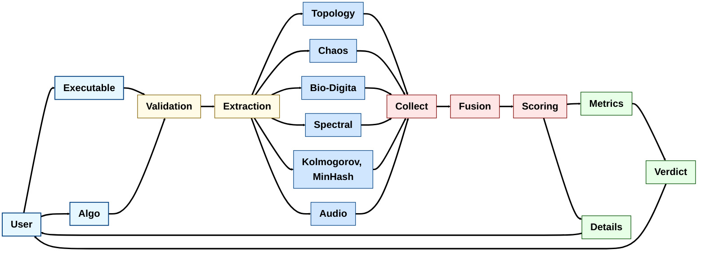

# <samp> OUROBOROS </samp>

<samp> **OUROBOROS is a research-focused forensic toolkit that analyzes binary executables using a broad set of mathematical, statistical and interdisciplinary methods. It is designed to extract robust, explainable signals (topological, spectral, dynamical, informational) and fuse them into an ensemble verdict for advanced malware and anomaly detection.**

<samp>

   
**
Technical Details
**

  
**
 Algorithms  
**

* **Topology & Fractals** — homology, zigzag, autoencoder, multifractal, fluid TDA.  
* **Graphs & Dynamics** — spectral clustering, DTW, quantum walk, symbiotic trees, chrono‑slicing.  
* **Entropy & Compression** — NCD, event horizons, Benford, stylometry.  
* **Symbolic & Hybrid** — Z3 execution, neural‑symbolic verifier, gravitational lensing.  
* **Latent & Perceptual** — LDA topics, MinHash LSH, RQA, sonification.  

   
**
Mathematical Appendix
**

  
**
1. Takens' Embedding Theorem, VR Persistence Stability, Wasserstein Kernels & Persistent Entropy
**

**For dynamical system $f: M \to M$, observation $\phi: M \to \mathbb{R}$, define delay map:
$$F(x) = (\phi(x), \phi(f(x)), \dots, \phi(f^{2m}(x)))$$
where $m = \dim(M)$. Generically, $F$ is embedding. Implementation: $d \geq 2m+1$, $\tau$ optimal:
$$\text{MI}(\tau) = \sum p(x_t, x_{t+\tau}) \log\frac{p(x_t, x_{t+\tau})}{p(x_t)p(x_{t+\tau})}$$
**Vectors:** $X_i = [x_i, x_{i+\tau}, \dots, x_{i+(d-1)\tau}]^T$ . For point clouds $X, Y$, diagrams $D_X, D_Y$:
$$W_\infty(D_X, D_Y) \leq d_H(X, Y)$$
where $W_\infty(D_1, D_2) = \inf_{\eta} \sup_{x \in D_1} ||x - \eta(x)||_\infty$
with $\eta: D_1 \to D_2$ bijection.** **$p$-Wasserstein between diagrams $D_1, D_2$:
$$W_p(D_1, D_2) = \left( \inf_{\eta} \sum_{x \in D_1} ||x - \eta(x)||^p \right)^{1/p}$$ Kernel via heat diffusion:
$$k(D_1, D_2) = \frac{1}{8\pi t} \sum_{p \in D_1} \sum_{q \in D_2} e^{-\frac{||p-q||^2}{8t}}$$ Sliced-Wasserstein: Project to lines $\theta \in S^1$:
$$SW(D_1, D_2) = \int_{S^1} W_1(\pi_\theta(D_1), \pi_\theta(D_2)) d\theta$$** **Define persistence: $p_i = d_i - b_i$  Total persistence: $L = \sum_{i=1}^n p_i$  Normalized persistence: $P_i = \frac{p_i}{L}$  Persistent entropy: $$H = -\sum_{i=1}^n P_i \log_2 P_i$$ Persistence intervals $\{(b_i, d_i)\}_{i=1}^n$**
**Properties: Max: $H_{\max} = \log_2 n$ when $P_i = \frac{1}{n} \ \forall i$ , Min: $H_{\min} = 0$ when $\exists k$ such that $P_k = 1$, $P_i = 0 \ \forall i \neq k$ , Monotonic: Adding zero-length intervals leaves $H$ unchanged, Scale-invariant: $H(\alpha p_i) = H(p_i)$ for $\alpha > 0$**

#

  
**
2. Multifractal Spectrum, RQA Quantifiers, Cheeger Inequality & DTW Optimization
**

**Partition function: $Z(q, \epsilon) = \sum_i \mu(B_i(\epsilon))^q$, Scaling: $Z(q, \epsilon) \sim \epsilon^{\tau(q)}$ as $\epsilon \to 0$, Legendre transform: $$\alpha(q) = \frac{d\tau}{dq}, \quad f(\alpha) = q\alpha - \tau(q)$$, Proof: From large deviations: $\Pr(\alpha_\epsilon \approx \alpha) \sim \epsilon^{-f(\alpha)}$, Recurrence matrix:
$$R_{ij} = \Theta(\varepsilon - \lVert X_i - X_j \rVert)$$ where: $\Theta$: Heaviside function, $\varepsilon$: recurrence threshold, $X_i \in \mathbb{R}^d$: embedded vectors, Recurrence rate (RR): $$RR = \frac{1}{N^2} \sum_{i,j=1}^N R_{ij}$$, Determinism (DET): Let $P_{\ell} = \text{number of diagonal lines of length } \ell \text{ in } R$
$$DET = \frac{\sum_{\ell=\ell_{\min}}^{N} \ell \cdot P_{\ell}}{\sum_{\ell=1}^{N} \ell \cdot P_{\ell}}$$, Laminarity (LAM): Let $P_{v} = \text{number of vertical lines of length } v \text{ in } R$, $$LAM = \frac{\sum_{v=v_{\min}}^{N} v \cdot P_{v}}{\sum_{v=1}^{N} v \cdot P_{v}}$$, Typical parameters: $\ell_{\min} = 2$ (minimal diagonal line length), $v_{\min} = 2$ (minimal vertical line length), Interpretation: $RR \in [0,1]$: density of recurrence points, $DET \in [0,1]$: predictability of system, $LAM \in [0,1]$: presence of laminar states For graph $G$, normalized Laplacian $L = I - D^{-1/2}AD^{-1/2}$, eigenvalues $0 = \lambda_0 \leq \lambda_1 \leq \dots$, Cheeger constant: $h(G) = \min_{S \subset V} \frac{|\partial S|}{\min(\text{vol}(S), \text{vol}(V\setminus S))}$, Inequality: $\frac{\lambda_1}{2} \leq h(G) \leq \sqrt{2\lambda_1}$, Proof: Rayleigh quotient minimax. Cost matrix $D_{ij} = ||x_i - y_j||$, recurrence: $$C(i,j) = D_{ij} + \min\{C(i-1,j), C(i,j-1), C(i-1,j-1)\}$$, with $C(0,0) = 0$, $C(i,0) = C(0,j) = \infty$, Sakoe-Chiba band: $|i-j| \leq w$, complexity $O(w \cdot \min(m,n))$**

#

  
**
3. NCD & Information Distance, Benford Distribution, MinHash Analysis & LDA Parameter Estimation
**

**Based on Kolmogorov complexity $K(x)$: $$d(x,y) = \frac{\max\{K(x|y), K(y|x)\}}{\max\{K(x), K(y)\}}$$, NCD approximation: $C$ compressor,
$$NCD(x,y) = \frac{C(xy) - \min\{C(x), C(y)\}}{\max\{C(x), C(y)\}}$$, Properties: $0 \leq NCD \leq 1 + \epsilon$, $NCD(x,x) \approx 0$, First digit law: $P(d) = \log_{10}\left(1 + \frac{1}{d}\right)$ for $d \in \{1,\dots,9\}$, Derivation: Scale invariance → unique solution: $P(S) = \int_S \frac{1}{x \ln 10} dx$, Test statistic: $\chi^2 = \sum_{d=1}^9 \frac{(n_d - nP(d))^2}{nP(d)} \sim \chi^2_8$, For sets $A,B$, permutations $\pi_1,\dots,\pi_k$: $$\hat{J}(A,B) = \frac{1}{k}\sum_{i=1}^k \mathbb{I}[\min(\pi_i(A)) = \min(\pi_i(B))]$$, Variance: $\text{Var}(\hat{J}) = \frac{J(1-J)}{k}$, Proof: $\Pr(\min(\pi(A)) = \min(\pi(B))) = \frac{|A \cap B|}{|A \cup B|} = J(A,B)$, Joint probability: $$p(\mathbf{w}, \mathbf{z}, \theta|\alpha, \beta) = \prod_d p(\theta_d|\alpha) \prod_n p(z_{dn}|\theta_d) p(w_{dn}|z_{dn},\beta)$$, M-step for $\beta$: $\beta_{kw} \propto \sum_{d,n} \phi_{dnk} \mathbb{I}[w_{dn} = w]$, Topic entropy: $H_d = -\sum_k \theta_{dk} \log \theta_{dk}$**

#

  
**
4. Lyapunov & Hurst Estimation, Isomap & LLE Optimization, QMC Error Analysis & Ensemble Fusion
**

**Lyapunov exponent: $\lambda = \lim_{t \to \infty} \frac{1}{t} \ln \frac{\|\delta(t)\|}{\|\delta(0)\|}$; **Wolf's algorithm:** $\lambda \approx \frac{1}{M \Delta t} \sum_{k=1}^{M} \ln \frac{L'(t_k)}{L(t_{k-1})}$; Hurst exponent: $\frac{R(n)}{S(n)} \sim c n^{H}$, where $R(n) = \max_{1 \le k \le n} \sum_{j=1}^{k} (X_j - \langle X \rangle_n) - \min_{1 \le k \le n} \sum_{j=1}^{k} (X_j - \langle X \rangle_n)$, Isomap: Geodesic distance $d_G(i,j) = \min_{P} \sum_{(u,v)\in P} ||x_u - x_v||$, MDS: minimize $\sum_{ij} (d_G(i,j) - ||y_i - y_j||)^2$, LLE: Reconstruct weights $w_{ij}$ minimizing: $$\Phi(W) = \sum_i ||x_i - \sum_{j \in N(i)} w_{ij}x_j||^2, \quad \sum_j w_{ij} = 1$$, Koksma-Hlawka: $|\hat{I} - I| \leq V(f) D_N^*$**
**For Sobol sequence:** $\displaystyle D_N^* = O\!\left(\frac{(\log N)^d}{N}\right)$, **Monte Carlo error:** $\displaystyle O\!\left(\frac{\sigma_f}{\sqrt{N}}\right)$ **where** $\displaystyle \sigma_f^2 = \mathbb{E}[(f-\mu_f)^2]$, **Coverage:** $\displaystyle \lim_{N \to \infty} D_N^* \to 0$, **QMC achieves** $\displaystyle D_N^* = o(N^{-1/2})$, **Ensemble: Let $\displaystyle \mathcal{H} = \{h_t: \mathcal{X} \to \mathcal{Y}\}_{t=1}^T$, predictions $\displaystyle \hat{y}_i^t = h_t(x_i)$, true labels $y_i \in \mathcal{Y}$.** **Bayesian fusion: $\displaystyle p(y|x, \mathcal{D}) \propto p(y) \prod_{t=1}^T p(h_t(x)|y, \mathcal{D})$.**

</samp>

        

   
**
Architecture
**

   
**
References
**

   
**The core references grounding this work span computational topology, dynamical systems, probabilistic modeling, and numerical methods. Foundational texts include Edelsbrunner and Harer’s *Computational Topology* and their stability results on persistence diagrams, Villani’s *Optimal Transport* for Wasserstein theory, and Strogatz’s *Nonlinear Dynamics and Chaos* alongside Rosenstein, Wolf, and Ott’s algorithms for Lyapunov exponents. Bishop’s *Pattern Recognition and Machine Learning* provides background on LDA and probabilistic models, while Niederreiter’s work on Sobol sequences underpins quasi‑Monte Carlo sampling. Together, these sources supply the theoretical backbone for persistence, chaos analysis, probabilistic inference, and advanced sampling techniques.**

