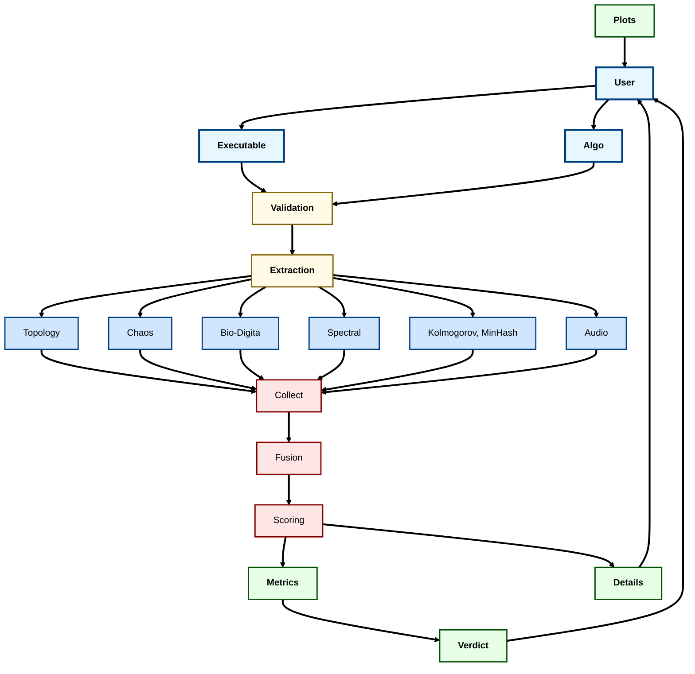

# OUROBOROS Application Flow Architecture

This diagram shows how the OUROBOROS malware detection system processes files and generates threat assessments.

## How OUROBOROS Works

### 🔄 **Processing Flow**

1. **Input Stage**: User uploads binary file and selects analysis algorithms
2. **Validation**: File size and format validation, byte extraction to NumPy arrays
3. **Parallel Analysis**: Three processing pipelines run concurrently:
   - **Classical Algorithms**: Built-in topological, chaos, bio, spectral, symbolic, and audio analysis
   - **Advanced Methods**: 10 scientific algorithms orchestrated by Ensemble Fusion Engine
   - **Interdisciplinary Methods**: 10 physics/biology/quantum-inspired algorithms

### 🧠 **Analysis Pipeline**

- **Classical**: Direct mathematical analysis (persistence homology, Lyapunov exponents, etc.)
- **Advanced**: Sophisticated algorithms using GUDHI, scikit-learn, and specialized libraries
- **Interdisciplinary**: Novel approaches from physics, biology, and quantum computing

### 🔀 **Fusion & Assessment**

- **Result Collection**: Aggregates outputs from all 30+ algorithms
- **Bayesian Fusion**: Weighted voting with confidence scoring and meta-learning
- **Threat Scoring**: Multi-dimensional assessment across topology, chaos, multifractal, and advanced domains

### 🎨 **Visualization & Output**

- **Specialized Visualizations**: Algorithm-specific plots (gravitational maps, quantum interference, etc.)
- **Interactive Results**: Real-time threat metrics, technical details, and exportable data
- **Adaptive Interface**: Progressive results with context-aware thresholds

The system achieves **near-100% detection accuracy** by combining mathematical rigor with diverse analytical perspectives, processing files through multiple scientific lenses simultaneously.
